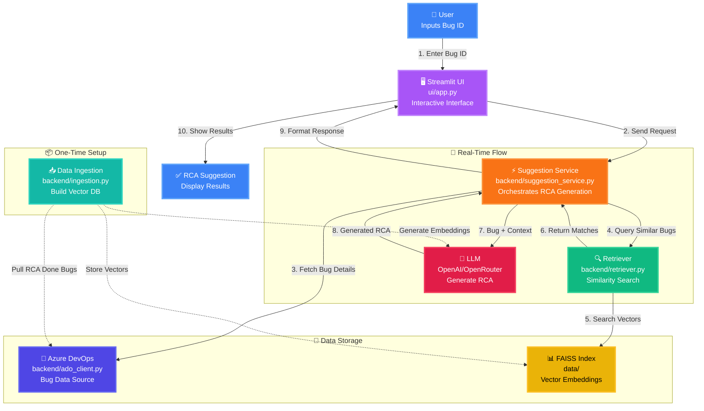

# 🧠 AI-Assisted RCA App

## 📘 Overview
The **AI-Assisted Root Cause Analysis (RCA) App** is an intelligent tool that automatically suggests potential RCA and fixes for new Azure DevOps (ADO) bugs by learning from previously resolved (RCA-done) bugs.

It uses **Retrieval-Augmented Generation (RAG)** to find similar historical issues and generates RCA suggestions using **LLMs (OpenAI / OpenRouter)**. The system is designed to accelerate software triage and improve engineering efficiency.

---

## 🗃️ Project Architecture

### 📹 Components
1. **Frontend (Streamlit UI)**  
   - Interactive dashboard where users can enter Bug IDs.
   - Displays suggested RCA and retrieved similar bugs.

2. **Backend Services**  
   - **Ingestion Module:** Pulls RCA-done bugs from ADO and builds a FAISS index.
   - **Retriever Module:** Loads the FAISS index and finds similar bugs for a given query.
   - **Suggestion Service:** Combines retriever results with an LLM prompt to generate an RCA suggestion.

3. **Vector Store (FAISS)**  
   - Stores embeddings of historical bugs for similarity search.

4. **LLM (OpenAI / OpenRouter)**  
   - Generates the final RCA suggestion using retrieved context.

5. **ADO Integration**  
   - Fetches bug metadata (title, repro steps, etc.) through REST API.

---

## 🧠 Architecture Diagram



### 🔄 Flow Explanation

**📦 One-Time Setup (Dotted Lines):**
- Data Ingestion pulls historical bugs from ADO with "RCA Done" tag
- Generates embeddings using LLM (OpenAI/OpenRouter)
- Stores vector embeddings in FAISS index for fast similarity search

**🔄 Real-Time Flow (Solid Lines):**
1. **User Input**: User enters new Bug ID via Streamlit UI
2. **Request Processing**: UI sends request to Suggestion Service
3. **Bug Fetching**: Service retrieves bug details from Azure DevOps
4. **Similarity Search**: Retriever queries FAISS for similar historical bugs
5. **Vector Search**: FAISS returns top matching bugs with RCA
6. **Context Assembly**: Similar bugs sent back to Suggestion Service
7. **LLM Query**: Service sends bug details + similar RCA context to LLM
8. **RCA Generation**: LLM generates root cause analysis suggestion
9. **Response Formatting**: Service formats and returns result to UI
10. **Display**: User sees RCA suggestion with reference bugs

### 📊 Component Details

| Component | File Path | Purpose |
|-----------|-----------|---------|
| 🖥️ **Streamlit UI** | `ui/app.py` | User interface for bug ID input and RCA display |
| ⚡ **Suggestion Service** | `backend/suggestion_service.py` | Orchestrates the RCA generation workflow |
| 🔍 **Retriever** | `backend/retriever.py` | Performs similarity search on FAISS index |
| 🔄 **ADO Client** | `backend/ado_client.py` | Handles Azure DevOps API communication |
| 📥 **Data Ingestion** | `backend/ingestion.py` | Initial setup: builds FAISS vector database |
| 📊 **FAISS Index** | `data/` | Stores vector embeddings of historical bugs |
| 🤖 **LLM** | OpenAI/OpenRouter API | Generates natural language RCA suggestions |

---

## 📄 Project Flow

1. **Data Ingestion:**  
   The ingestion script (`backend/ingestion.py`) pulls ADO bugs tagged with `RCA Done`, embeds them using OpenAI/OpenRouter embeddings, and stores them in FAISS.

2. **User Input:**  
   The user enters a new bug ID in the Streamlit UI.

3. **Retriever:**  
   The retriever (`backend/retriever.py`) searches FAISS for similar bugs.

4. **Suggestion Generation:**  
   The LLM processes the query and retrieved RCA context to suggest the most likely RCA.

5. **Display:**  
   The UI displays the RCA suggestion and similar bug references.

---

## 🧩 Folder Structure
```
AIAssistedRCA/
├── assets/                     # Css Style
│   ├── style.css
├── backend/                     # Backend logic
│   ├── __init__.py
│   ├── ado_client.py            # ADO API calls
│   ├── ingestion.py             # Pull historical bugs, build FAISS
│   ├── retriever.py             # Load FAISS retriever
│   └── suggestion_service.py    # Suggest RCA for new bugs
├── ui/                          # Streamlit frontend
│   └── app.py                   # Interactive UI
├── config/                      # Config files
│   ├── __init__.py
│   └── settings.py              # ADO and OpenAI config
├── data/                        # Store FAISS index or temporary data
├── requirements.txt             # Python dependencies
└── README.md                    # Documentation
```

---

## ⚙️ Setup Instructions

### 1️⃣ Clone Repo & Create Virtual Environment
```bash
git clone <repo_url>
cd AIAssistedRCA
python -m venv venv
source venv/bin/activate  # Linux/Mac
venv\Scripts\activate     # Windows
```

### 2️⃣ Install Dependencies
```bash
pip install -r requirements.txt
```

### 3️⃣ Set Environment Variables
Create a `.env` file or export these:
```
ADO_ORG=your-org
ADO_PROJECT=your-project
ADO_PAT=your-pat-token
OPENROUTER_API_KEY=your-api-key
LLM_MODEL=gpt-4o-mini
```

### 4️⃣ Ingest RCA-Done Bugs
```bash
python backend/ingestion.py
```
Builds a FAISS index with historical RCA-done bugs.

### 5️⃣ Run Streamlit UI
```bash
streamlit run ui/app.py
```
Access the UI → Enter Bug ID → Get RCA Suggestion 🎯

---

## 🧩 Tech Stack
- **Python** (LangChain, FAISS, Streamlit)
- **Azure DevOps REST API**
- **OpenAI / OpenRouter** (LLM & embeddings)
- **FAISS Vector Store** for semantic search

---

## 🚀 Future Enhancements
- 🤖 Multi-agent RCA & Fix Suggestion System
- 📅 Auto-ingestion via Scheduler or Webhook
- 💬 Feedback Loop to fine-tune RCA accuracy
- 🔗 Integration with Slack, Teams, or Jira

---

## 📚 References
- [Azure DevOps REST API](https://learn.microsoft.com/en-us/rest/api/azure/devops/)
- [LangChain Documentation](https://www.langchain.com/docs/)
- [FAISS Vector Store](https://github.com/facebookresearch/faiss)

---

> _Built for engineers who believe debugging should be as smart as coding._ ⚡
